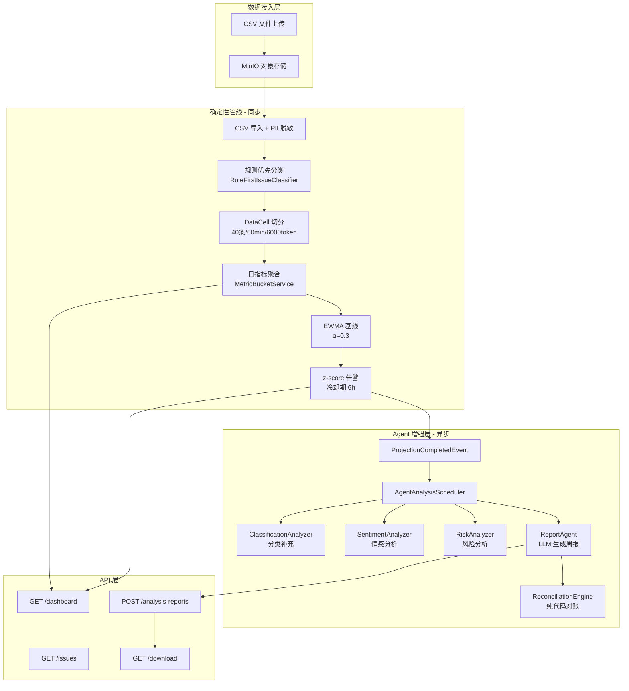
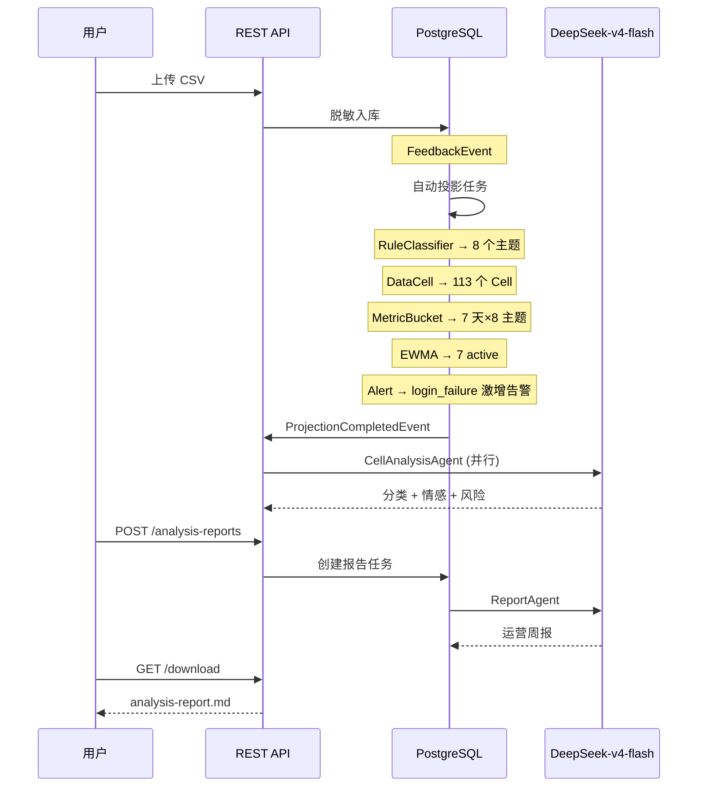
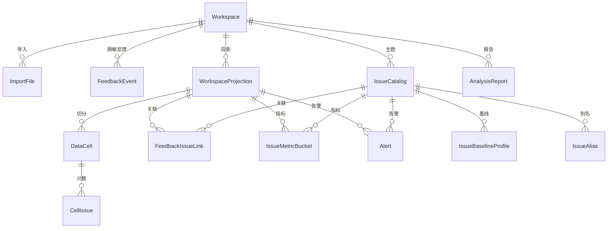
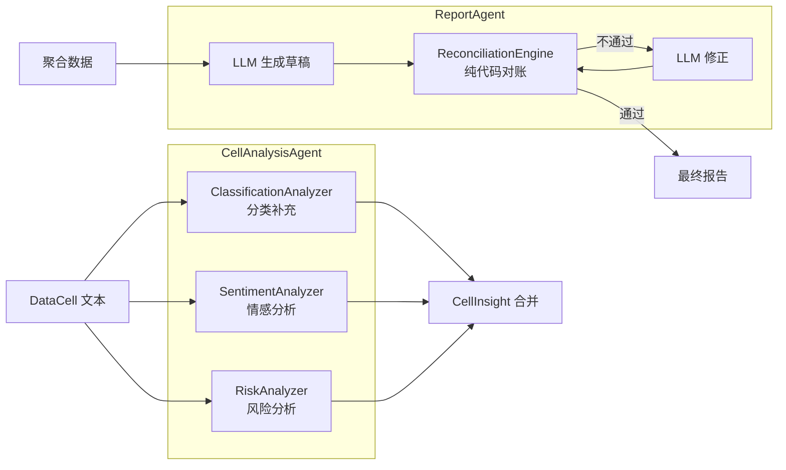

# InsightFlow

> 游戏客服舆情分析系统 — 自动化导入、主题识别、趋势监控、异常告警、AI 报告生成

## 技术栈

| 层级 | 技术 |
|------|------|
| 语言 | Java 17 |
| 框架 | Spring Boot 3.5 |
| AI | Spring AI + DeepSeek-v4-flash（阿里云百炼） |
| 数据库 | PostgreSQL 16 + pgvector |
| 缓存 | Redis 7 |
| 对象存储 | MinIO |
| 迁移 | Flyway V1-V8 |
| 部署 | Docker Compose |

## 快速启动

```powershell
# 1. 启动基础设施
docker compose up -d

# 2. 配置 API Key（可选，Agent 层需要）
$env:DASHSCOPE_API_KEY = "sk-xxx"

# 3. 启动应用
./mvnw.cmd spring-boot:run

# 4. 验证
curl http://localhost:8080/actuator/health
```

## 系统架构



## 数据流全链路



## 数据库 ER 图



## Agent 架构



## 项目结构

```
src/main/java/com/insightflow/
├── InsightFlowApplication.java
├── agent/                          # Agent 增强层
│   ├── InsightAgent.java           # Agent 接口
│   ├── AgentOrchestrator.java      # 并行编排器
│   ├── AgentFallbackManager.java   # 降级管理
│   ├── CellAnalysisAgent.java      # Cell 分析（3 Analyzer 并行）
│   ├── AgentAnalysisScheduler.java # 事件监听 + 异步调度
│   ├── LlmMetrics.java             # Token 指标
│   ├── analyzer/                   # 三个 Analyzer
│   │   ├── ClassificationAnalyzer.java
│   │   ├── SentimentAnalyzer.java
│   │   └── RiskAnalyzer.java
│   ├── report/                     # 报告生成
│   │   ├── ReportAgent.java
│   │   ├── ReconciliationEngine.java
│   │   └── ReportTools.java
│   ├── dto/                        # 结构化输出
│   └── event/                      # 领域事件
├── controller/                     # HTTP 边界
│   ├── WorkspaceController.java
│   ├── FileImportController.java
│   ├── DashboardController.java
│   └── ReportController.java
├── service/
│   ├── analysis/                   # 分析管线
│   │   ├── IssueRulesLoader.java
│   │   ├── IssueTextNormalizer.java
│   │   ├── RuleFirstIssueClassifier.java
│   │   ├── DataCellBuilder.java
│   │   ├── IssueCatalogService.java
│   │   ├── ProjectionSourceLoader.java
│   │   ├── ProjectionFactWriter.java
│   │   ├── MetricBucketService.java
│   │   ├── EwmaBaselineService.java
│   │   ├── AlertDetector.java
│   │   └── WorkspaceProjectionExecutionService.java
│   ├── importing/                  # CSV 导入
│   ├── DashboardService.java
│   ├── ReportCommandService.java
│   └── KnowledgeService.java
├── task/                           # 异步任务
│   ├── ImportTask*.java            # 导入调度
│   ├── WorkspaceProjection*.java   # 投影调度
│   └── AnalysisReport*.java        # 报告调度
├── entity/                         # JPA 实体（19 张表）
├── repository/                     # Spring Data 仓储（12 个）
├── config/                         # 配置
├── storage/                        # MinIO
├── common/exception/               # 异常处理
└── dto/                            # 传输对象
```

## API 文档

| 方法 | 路径 | 说明 |
|------|------|------|
| POST | `/api/v1/workspaces` | 创建工作区 |
| POST | `/api/v1/workspaces/{id}/imports/files` | 上传 CSV |
| POST | `/api/v1/workspaces/{id}/imports/files/{fid}/mapping` | 保存字段映射 |
| POST | `/api/v1/workspaces/{id}/imports/files/{fid}/start` | 启动导入 |
| GET | `/api/v1/workspaces/{id}/dashboard` | 看板摘要 |
| GET | `/api/v1/workspaces/{id}/issues` | 主题列表 |
| GET | `/api/v1/workspaces/{id}/issues/{key}` | 主题详情 |
| POST | `/api/v1/workspaces/{id}/analysis-reports` | 创建报告 |
| GET | `/api/v1/workspaces/{id}/analysis-reports/{rid}` | 查询报告 |
| GET | `/api/v1/workspaces/{id}/analysis-reports/{rid}/download` | 下载报告 |

## 配置说明

| 配置项 | 默认值 | 说明 |
|--------|--------|------|
| `DASHSCOPE_API_KEY` | — | 阿里云百炼 API Key |
| `spring.ai.openai.model` | `deepseek-v4-flash` | LLM 模型 |
| `insightflow.agent.enabled` | `true` | Agent 开关 |
| `insightflow.analysis.ewma-alpha` | `0.3` | EWMA 平滑因子 |
| `insightflow.analysis.alert-cooldown-hours` | `6` | 告警冷却期 |

## 测试

```powershell
# 运行全部测试
./mvnw.cmd test

# 运行特定测试
./mvnw.cmd test -Dtest=MetricBucketServiceTest
```

## 开发进度

| 阶段 | 功能 | 状态 |
|------|------|------|
| Phase 1 | CSV 导入 + PII 脱敏 | ✅ |
| Phase 2 | DataCell + 规则分类 | ✅ |
| Phase 3A | 日指标聚合 | ✅ |
| Phase 3B | EWMA 基线 + 告警 | ✅ |
| Phase 4 | Agent 层 + Spring AI | ✅ |
| Phase 5 | 看板 API + 报告 API | ✅ |
| 待定 | 前端页面 | ❌ |
| 待定 | RAG 向量搜索 | ❌ |
| 待定 | main 分支合并 | ❌ |