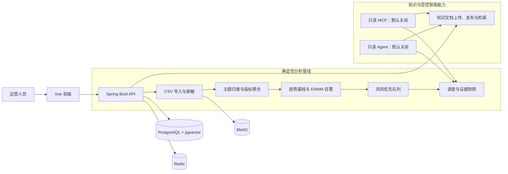

# InsightFlow

InsightFlow 是一个面向用户反馈运营的可演示分析系统：将 CSV 反馈在导入时脱敏，归纳为可追踪的主题和趋势，通过 EWMA 识别异常；再把告警转为带证据的调查与人工跟进任务。它把自动化分析限定为辅助决策，而不是替代人工处置。

## 核心能力

- **CSV 脱敏导入**：支持上传、字段映射和异步导入；原始文件存入 MinIO，分析侧只使用脱敏后的反馈事件与元数据。
- **主题、趋势与告警**：基于规则优先的主题归类，按时间聚合指标，并以 EWMA 基线和异常阈值发现波动。
- **调查取证**：告警可进入调查队列；受控只读工具生成主题趋势、样本与数据可用性等证据快照，供后续复核。
- **可解释风险优先队列**：以冻结的优先级和依据辅助排序；人工可以发起、跟进和复核调查，系统不自动执行策略变更。
- **知识库**：支持文档上传、版本发布/过期管理，以及工作区范围内的检索和证据引用。
- **受控 Agent 与可选 MCP**：Agent 只在显式开启时运行，回答附带证据；MCP 仅开放只读调查与知识检索工具。

## 技术栈

| 层级 | 采用技术 |
| --- | --- |
| 后端 | Java 17、Spring Boot 3.5、Spring AI |
| 前端 | Vue 3、Vite、Pinia、Chart.js、Tailwind CSS |
| 数据与存储 | PostgreSQL 16 + pgvector、Redis 7、MinIO |
| 数据迁移与部署 | Flyway、Docker Compose |

## 架构



## 环境前置

- Docker 与 Docker Compose
- JDK 17
- Node.js（仅在启动前端时需要）

## 本地启动

先从示例环境文件创建本地 `.env`，再启动基础依赖：

```powershell
Copy-Item .env.example .env
docker compose --env-file .env up -d
```

启动后端前，为本地安全初始化设置仅存在于当前终端的随机值：

```powershell
$env:INSIGHTFLOW_JWT_SECRET = "请替换为至少 32 字节的本地随机字符串"
$env:INSIGHTFLOW_BOOTSTRAP_TOKEN = "请替换为一次性本地初始化令牌"
.\mvnw.cmd spring-boot:run
```

默认 API 地址为 `http://localhost:8080`，可通过 `http://localhost:8080/actuator/health` 查看健康状态。

前端为可选启动项：

```powershell
Set-Location frontend
npm install
npm run dev
```

## 演示路径

1. 在前端创建或选择一个工作区。
2. 进入“数据导入”，上传 CSV、确认字段映射并启动导入。
3. 在“看板”和“主题”中查看聚合趋势、主题明细和异常告警。
4. 打开“调查”，从风险优先队列查看告警依据、冻结证据并人工发起跟进。
5. 进入“知识库”上传文档、发布版本；随后在受控调查或对话中检索带来源的知识证据。

## 测试命令

后端测试：

```powershell
.\mvnw.cmd test
```

前端测试：

```powershell
Set-Location frontend
npm test
```

## 项目结构

```text
src/main/java/com/insightflow/
├── controller/       # HTTP API 边界
├── service/          # 导入、投影和分析编排
├── investigation/    # 调查任务、证据快照和人工跟进
├── risk/             # 风险评分与优先级快照
├── knowledge/        # 知识文档、发布和检索
├── agent/            # 受控只读 Agent
├── mcp/              # 可选只读 MCP 工具
├── entity/           # 工作区隔离的领域实体
└── storage/          # MinIO 文件存储
frontend/
├── src/views/        # 看板、导入、调查和知识库页面
├── src/stores/       # 前端状态管理
└── test/             # 前端运行时状态测试
```

## 安全边界

- 所有业务读写按 `workspace_id` 隔离，对外 API 使用公开 UUID，不暴露内部主键。
- CSV 在进入分析流程时执行脱敏；原始文件与分析数据分离存放。
- `AGENT_ENABLED` 和 `MCP_ENABLED` **默认均为 `false`**。只有显式设置为 `true` 才会启用相应能力；MCP 仅提供只读工具。
- API Key 仅通过环境变量（例如 `DASHSCOPE_API_KEY`）注入；不要把 Key、密码、Token 或真实业务数据写进仓库、示例配置或日志。
- Agent 的作用是受控只读调查与证据辅助；策略变更和跟进处置仍由人工确认。
