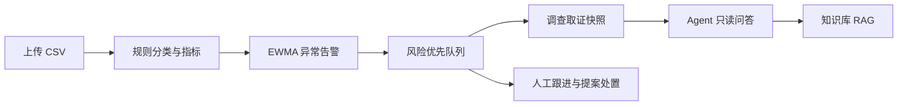
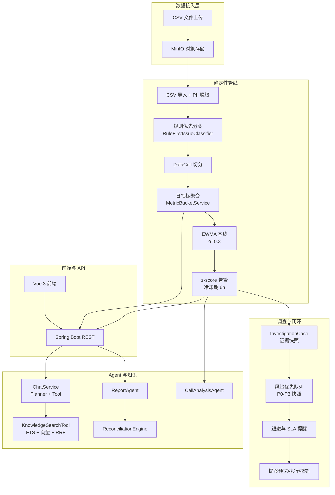
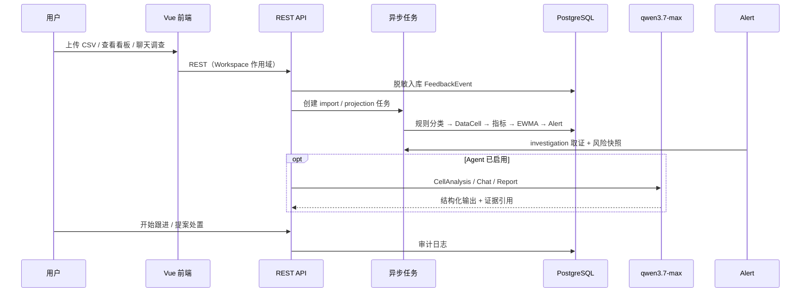
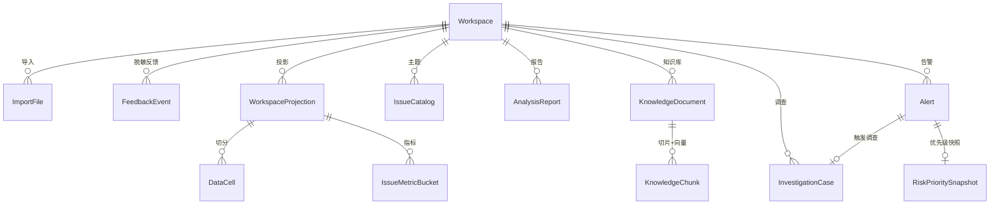
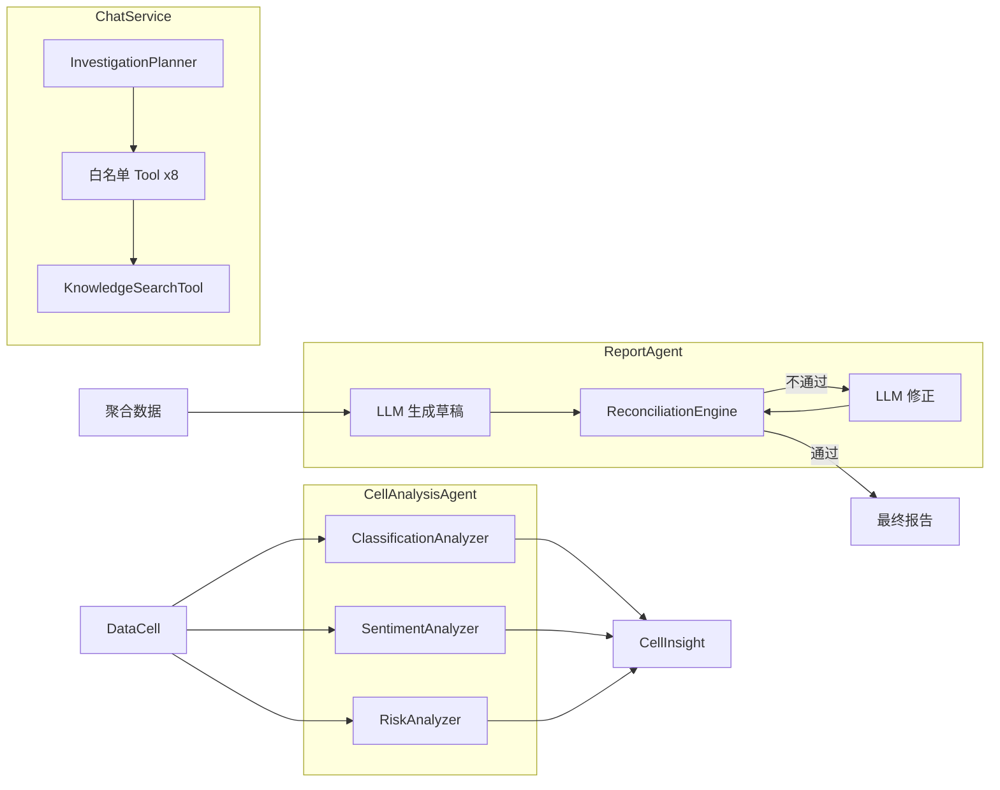

# InsightFlow

> 游戏客服舆情分析系统 — CSV 导入、规则优先主题识别、EWMA 异常告警、可解释风险队列、Agent 只读调查与企业知识库 RAG

InsightFlow 面向游戏/产品线的**用户反馈舆情分析**场景：确定性分析管线负责导入、分类、指标与告警；Agent 层提供受控只读调查、知识库问答与证据化报告。所有业务写入与策略变更均需人工确认。

**架构原则：** Workspace 隔离 · 规则优先 + LLM 增强 · Agent 只读 · 人工处置可审计

---

## 产品预览

> 将前端截图放入 `docs/assets/screenshots/`，替换下方占位路径即可在 GitHub 上展示。

| 页面 | 解决什么问题 | 截图占位 |
|------|--------------|----------|
| **首页 / AI 调查** | 多轮聊天 + 受控 Tool 只读查询反馈与指标 | `docs/assets/screenshots/01-home.png` |
| **数据导入** | CSV 上传、字段映射、异步导入与 PII 脱敏 | `docs/assets/screenshots/02-import.png` |
| **趋势看板** | 主题指标趋势、EWMA 异常告警 | `docs/assets/screenshots/03-dashboard.png` |
| **调查中心** | 可解释风险优先队列、跟进状态与证据快照 | `docs/assets/screenshots/04-investigations.png` |
| **知识库** | 文档治理、发布、混合检索 | `docs/assets/screenshots/05-knowledge.png` |
| **运营报告** | 异步生成报告、确定性对账 | `docs/assets/screenshots/06-reports.png` |

<!--

*告警创建时冻结 P0–P3 优先级与原因，运营按可解释队列处理，而非每次刷新重算。*
-->

---

## 核心能力

### 1. 数据导入与治理

- CSV 上传 → 字段映射 → **PII 脱敏** → 异步 `import` 任务（租约 / 重试 / 幂等）
- 原始文件存 **MinIO**；可分析事实写入 PostgreSQL

### 2. 确定性舆情分析

- **规则优先** L1 主题 + L2 表达层分类（Topic Pack + TOML 规则）
- **DataCell** 切分、日指标聚合、**EWMA 基线** + z-score **异常告警**
- 不配置 LLM 也可跑通「导入 → 投影 → 看板 → 告警」主链路

### 3. 告警调查与运营闭环

- 告警触发异步调查取证与**证据快照**
- **可解释风险优先队列**（P0–P3 快照冻结，队列不重算历史分数）
- 跟进状态与调查取证状态正交；SLA 站内提醒；提案预览 / 执行 / 撤销与审计
- **指定时间段风险报告**：以冻结的 `[start, end)` 区间统一统计看板、调查证据与区间内新建告警，报告引用 P0–P3 快照而非模型猜测
- **P0/P1 邮件通知**：风险快照和调查卡片创建后先写入 PostgreSQL Outbox，再经 RocketMQ 异步发送脱敏摘要与卡片链接；收件人与 SMTP 凭据仅由环境变量注入

### 4. Agent 只读调查（可选，默认关闭）

- **ChatService**：InvestigationPlanner + 白名单 Tool（8 类数据查询 + 知识检索）
- **CellAnalysisAgent** / **ReportAgent** + **ReconciliationEngine** 确定性对账
- 全链路 **AgentRun** 追溯与 Prompt 版本化；**非**自由 ReAct 写库

### 5. 企业知识库与 RAG

- 文档类型治理（SOP、已知问题、版本说明、复盘等）；Organization / Workspace 可见性
- **FTS + 向量 + RRF** 混合检索（pgvector；嵌入模型 `text-embedding-v3`，1024 维）
- 聊天回答带 **knowledge:** 引用或明确弃权；Cross-encoder rerank 可选（默认关闭）

### 6. Vue 3 前端

- 路由页面：登录、首页、导入、数据、看板、报告、知识库、评测、调查中心
- Pinia 状态管理 + JWT 路由守卫；`npm run build` 产物由 Spring Boot 静态托管

### 7. MCP 只读暴露（可选，默认关闭）

- Spring AI MCP Server：调查 Tool + `insightflow_knowledge_search`

---

## 业务闭环



更完整的架构与模块职责见 [`docs/project-architecture.md`](docs/project-architecture.md)。

---

## 技术栈

| 层级 | 技术 |
|------|------|
| 后端 | Java 17、Spring Boot **3.5.16**、Spring Security、JPA |
| 通知 | PostgreSQL Outbox、RocketMQ、Spring Boot Mail / Java Mail（仅 P0/P1 风险邮件） |
| AI | Spring AI **1.1.0**、DashScope 兼容 API（默认聊天 `qwen3.7-max`，嵌入 `text-embedding-v3`） |
| 前端 | Vue **3** + Pinia + Vite + Tailwind + Chart.js |
| 数据库 | PostgreSQL 16 + **pgvector** |
| 对象存储 | MinIO |
| 缓存 | Redis 7（Compose 已提供；业务层按需接入） |
| 迁移 | Flyway **V1–V38** |
| 部署 | Docker Compose + Spring Boot 一体托管前端 |

---

## 快速启动

### 前置条件

- JDK 17、Maven（或使用 `./mvnw.cmd`）
- Docker Desktop（PostgreSQL / Redis / MinIO / RocketMQ）
- Node.js 18+（仅在前端需重新构建时）

### 1. 启动基础设施

```powershell
docker compose up -d
```

### 2. 本地配置

```powershell
Copy-Item src/main/resources/application-local.yml.example src/main/resources/application-local.yml
```

编辑 `application-local.yml`，至少填写：

| 配置项 | 说明 |
|--------|------|
| `insightflow.security.jwt-secret` | 至少 32 字节的随机字符串 |
| `insightflow.security.bootstrap-token` | 首次创建 Owner 用的一次性口令 |
| `spring.ai.openai.api-key` | DashScope API Key（Agent / RAG 嵌入需要） |
| `insightflow.agent.enabled` | 本地演示 Agent 时可设为 `true` |

### 3. （可选）构建前端

仓库已包含构建产物时可跳过；修改前端代码后需重新构建：

```powershell
cd frontend
npm install
npm run build
cd ..
```

产物输出到 `src/main/resources/static/`，由 Spring Boot 一并托管。

### 4. 启动应用

```powershell
# 可选：通过环境变量启用 Agent（亦可在 application-local.yml 中配置）
$env:AGENT_ENABLED = "true"
$env:DASHSCOPE_API_KEY = "sk-xxx"

./mvnw.cmd spring-boot:run
```

### 5. 访问与验证

```powershell
curl http://localhost:8080/actuator/health
```

浏览器访问：`http://localhost:8080/#/login`（Hash 路由）。首次使用前，用 bootstrap-token 创建 Owner 账号。

### 能力开关

| 开关 | 默认值 | 说明 |
|------|--------|------|
| `AGENT_ENABLED` | `false` | 关闭时导入/投影/告警/看板/知识库管理仍可用；聊天、Cell 分析、报告生成、向量嵌入依赖模型 |
| `MCP_ENABLED` | `false` | MCP Server 只读 Tool |
| `KNOWLEDGE_RERANKER_ENABLED` | `false` | Cross-encoder 精排 |
| `TOPIC_LLM_SKILL_ENABLED` | `false` | Pack 级 LLM 主题 Skill |
| `RISK_NOTIFICATION_OWNER_EMAIL` | — | P0/P1 调查卡片的单一 Owner 收件邮箱；为空时不投递 |
| `MAIL_HOST` / `MAIL_PORT` | `localhost` / `25` | SMTP 主机与端口；认证信息通过 `MAIL_USERNAME` / `MAIL_PASSWORD` 注入 |
| `ROCKETMQ_NAME_SERVER` | `localhost:9876` | RocketMQ NameServer 地址；本地 `docker compose up -d` 会启动单机 NameServer 与 Broker |
| `RISK_NOTIFICATION_ROCKETMQ_TOPIC` | `risk-email-notification` | P0/P1 邮件 Outbox 的消息 Topic |

---

## 文档

| 文档 | 说明 |
|------|------|
| [`docs/project-architecture.md`](docs/project-architecture.md) | 架构总览、模块职责、状态机 |
| [`docs/project-development-log.md`](docs/project-development-log.md) | 已验证变更与工程复盘 |
| [`AGENTS.md`](AGENTS.md) | 协作规范与架构边界 |

---

## 系统架构



---

## 数据流全链路



---

## 数据库 ER 图（核心域）



---

## Agent 架构



---

## 项目结构

```
src/main/java/com/insightflow/
├── agent/              # Agent：Cell 分析、聊天调查、报告、AgentRun
├── knowledge/          # 知识库治理、切片、嵌入、检索
├── mcp/                # MCP Server 只读 Tool
├── investigation/      # 告警调查、证据快照、跟进
├── risk/               # 风险优先级快照与队列
├── proposal/           # 提案预览/执行/撤销
├── controller/         # REST API（Workspace 作用域）
├── service/analysis/   # 导入、分类、投影、EWMA、告警
├── task/               # async_task 调度（import/projection/investigation/report/rag_evaluation）
├── evaluation/         # RAG 金标评测
├── security/           # JWT、Workspace 授权
└── entity/ / repository/

frontend/src/
├── views/              # Login, Home, Import, Dashboard, Knowledge, Investigations...
├── stores/             # Pinia（workspace, chat）
└── router/             # Hash 路由 + JWT 守卫
```

---

## API 文档（节选）

| 方法 | 路径 | 说明 |
|------|------|------|
| POST | `/api/v1/auth/bootstrap` | 首次创建 Owner |
| POST | `/api/v1/auth/login` | 登录获取 JWT |
| GET | `/api/v1/workspaces` | 工作区列表 |
| POST | `/api/v1/workspaces/{id}/imports/files` | 上传 CSV |
| POST | `/api/v1/workspaces/{id}/imports/files/{fid}/start` | 启动导入 |
| GET | `/api/v1/workspaces/{id}/dashboard` | 看板摘要 |
| GET | `/api/v1/workspaces/{id}/issues` | 主题列表 |
| GET | `/api/v1/workspaces/{id}/investigations` | 调查队列 |
| POST | `/api/v1/workspaces/{id}/chat/sessions/{sid}/messages` | 聊天消息 |
| GET/POST | `/api/v1/workspaces/{id}/knowledge/documents` | 知识库文档 |
| POST | `/api/v1/workspaces/{id}/analysis-reports` | 创建报告 |
| POST | `/api/v1/workspaces/{id}/rag-evaluations` | 触发 RAG 评测 |

完整契约以 Controller 与 OpenAPI（如有）为准。

---

## 配置说明

| 配置项 | 默认值 | 说明 |
|--------|--------|------|
| `DASHSCOPE_API_KEY` | — | DashScope API Key |
| `spring.ai.openai.chat.options.model` | `qwen3.7-max` | 聊天模型 |
| `insightflow.knowledge.embedding-model` | `text-embedding-v3` | 嵌入模型 |
| `insightflow.agent.enabled` | `false` | Agent 总开关 |
| `insightflow.mcp.enabled` | `false` | MCP Server 开关 |
| `insightflow.analysis.ewma-alpha` | `0.3` | EWMA 平滑因子 |
| `insightflow.analysis.alert-cooldown-hours` | `6` | 告警冷却期 |

---

## 测试

```powershell
# 后端
./mvnw.cmd test

# 前端
cd frontend && npm test && npm run build
```

---

## 功能状态

| 模块 | 功能 | 状态 |
|------|------|------|
| 数据接入 | CSV 导入 + PII 脱敏 + 异步任务 | ✅ |
| 分析管线 | DataCell + 规则分类 + EWMA 告警 | ✅ |
| 前端 | Vue 3 全页面 + Pinia + JWT | ✅ |
| 调查闭环 | InvestigationCase + 风险队列 + 跟进 | ✅ |
| 知识库 | 文档治理 + pgvector + 混合检索 RAG | ✅ |
| Agent | 聊天调查 + Cell 分析 + 报告对账 | ✅（需配置 API Key，`AGENT_ENABLED=true`） |
| 评测 | RAG 金标数据集 + 异步评测任务 | ✅ |
| MCP | 只读 Tool Server | ✅（默认关闭，`MCP_ENABLED=true` 启用） |
| 演进 | rerank 默认上线、外部 MCP 客户端联调等 | 见 `docs/agent-optimization-todo.md` |
