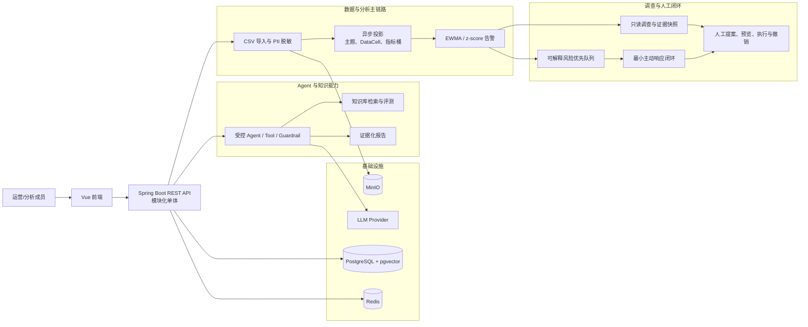
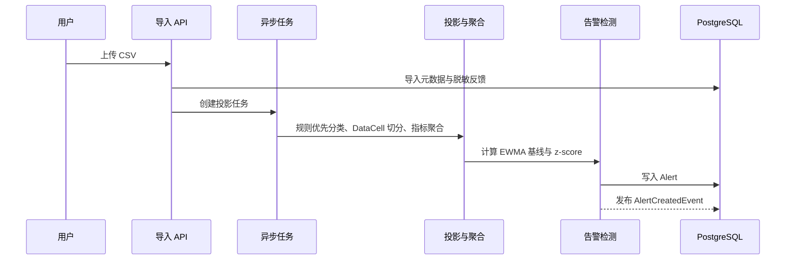
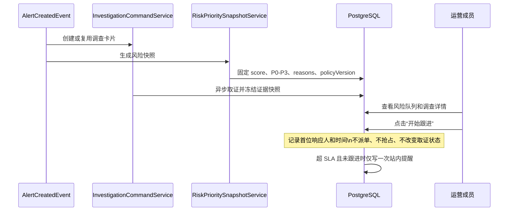
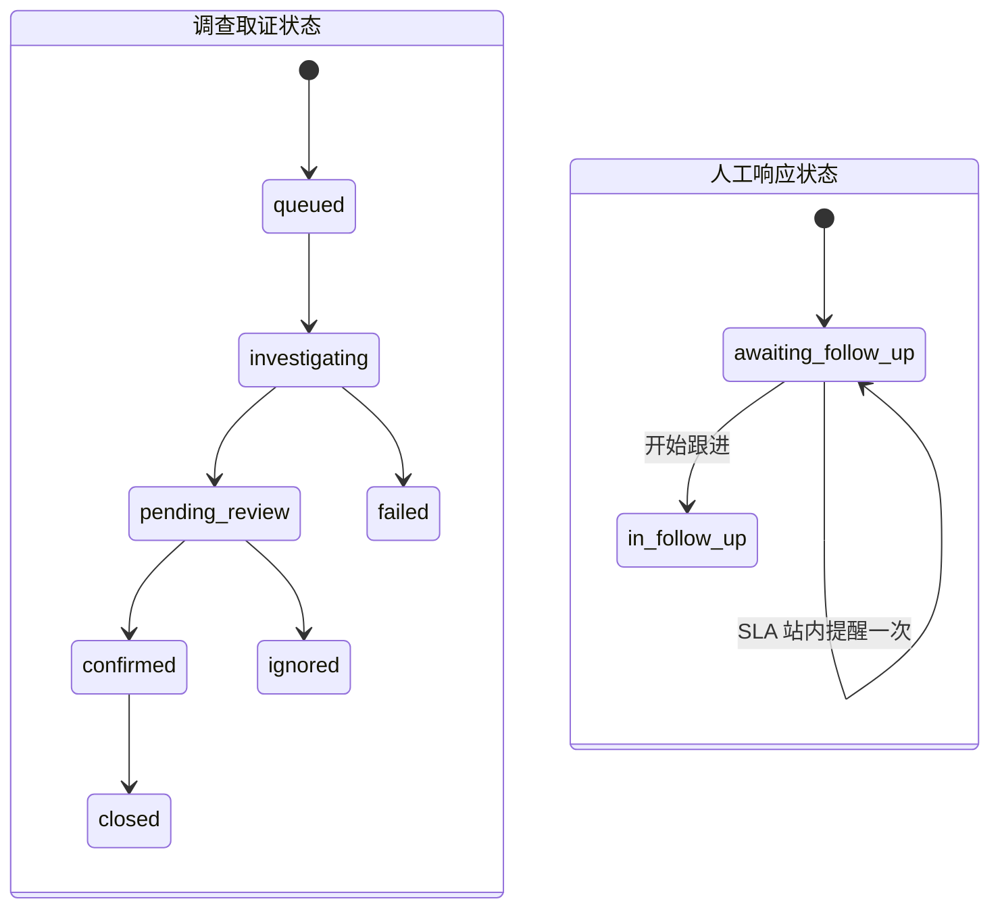

# InsightFlow 当前项目全架构

> 本文描述当前已实现的模块化单体架构，以及“可解释风险优先队列”和“最小主动响应闭环”接入后的运行方式。它是面试讲解与工程协作的架构总览；已验证的变更事实以 `docs/project-development-log.md` 为准。

## 1. 产品边界

InsightFlow 面向游戏或产品线的用户反馈分析场景：将 CSV 反馈转为可追溯的主题、趋势和异常告警；Agent 只做受控只读调查和提案生成，任何策略或业务处置均需人工确认。

- **Workspace 是隔离边界**：所有业务读写按 `workspace_id` 过滤，HTTP 只暴露 UUID 型 `public_id`。
- **确定性管线优先**：导入、脱敏、规则分类、聚合、EWMA 告警均不依赖模型输出。
- **Agent 只读**：通过 Tool、Guardrail 和 Trace 调查证据；不直接写业务状态。
- **人工处置可审计**：提案必须预览、确认、记录幂等键，必要时可撤销。

## 2. 总体架构

## 3. 核心业务流

### 3.1 从反馈到告警

### 3.2 告警后的调查、排序和响应

## 4. 模块职责

| 模块 | 主要职责 | 关键边界 |
|---|---|---|
| `controller` | Workspace 作用域 REST 契约 | 不直接修改实体，不暴露内部主键 |
| `service/analysis` | 导入、分类、投影、指标与告警 | 确定性计算，形成可复核业务事实 |
| `task` | 异步任务与重试 | 任务与 Workspace 双重校验 |
| `investigation` | 告警调查、证据快照、跟进命令与 SLA 提醒 | 调查状态与人工响应状态正交 |
| `risk` | 优先级计算、快照冻结、队列查询 | 队列不重算历史分数 |
| `proposal` / `correction` | 处置提案、预览、执行、撤销与纠错候选 | 人工确认、角色、幂等与审计 |
| `agent` / `knowledge` / `mcp` | 只读调查、RAG、评测与 MCP Tool | 不给模型数据库写权限，不保留原始思维链 |
| `security` | 当前用户、角色和 Workspace 授权 | 服务端为唯一授权边界 |
| `entity` / `repository` | 领域状态与受限持久化查询 | 所有跨工作区读取必须显式过滤 |

## 5. 新增方案的设计

### 5.1 可解释风险优先队列

告警创建后，`RiskPrioritySnapshotListener` 监听 `AlertCreatedEvent`，在独立事务中调用 `RiskPrioritySnapshotService`。它根据异常幅度、当前规模、主题风险权重和未响应时长计算分数，写入不可回写的快照：

`risk_priority_snapshot(alert_id, workspace_id, score, level, reasons, policy_version, created_at)`

- **P0-P3 由快照保存**：后续策略调整不会篡改历史排序。
- **原因对运营可见**：调查中心展示等级、分数、主题、数量和原因。
- **队列仅做受权读取**：`RiskQueueService` 先执行 Workspace 授权，再按 `score DESC, created_at DESC` 查询快照。

### 5.2 最小主动响应闭环

在既有 `InvestigationCase` 上增加独立字段：

`follow_up_status`、`follow_up_by_user_public_id`、`follow_up_started_at`、`follow_up_reminder_at`

- 调查取证仍由异步 Worker 推进 `queued → investigating → pending_review`。
- 运营成员点击 **开始跟进** 后，`FollowUpCommandService` 只记录首位响应人和开始时间，并写审计日志。
- 重复点击保持幂等：不会覆盖首位响应人。
- `FollowUpReminderService` 定时扫描超过 SLA、未开始跟进且尚未提醒的卡片，只标记一次站内提醒。
- 不包含责任人派发、外部消息、值班表或升级链路，避免过早演化为工单系统。

## 6. 数据与状态边界

两个状态机彼此独立：例如卡片仍在异步取证时，团队已可以开始跟进；已跟进也不会自动视为调查结论或业务处置完成。

## 7. 面试讲解主线

1. 原系统解决“发现异常与取证”，但没有回答“今天先处理什么、是否真的有人接住”。
2. 我用**告警时冻结的风险快照**补齐排序可解释性，避免前端临时重算造成历史口径漂移。
3. 我将**人工响应**与**异步调查**拆为正交状态，首期只记录首位响应事实和一次提醒，以最小成本降低漏处理风险。
4. 方案体现 Agent 边界：Agent 提供只读证据与提案，最终处置仍由权限、预览、幂等和审计保护。

## 8. 验证入口

- 后端风险与闭环：`RiskPriorityServiceTest`、`RiskPrioritySnapshotServiceTest`、`RiskQueueServiceTest`、`FollowUpCommandServiceTest`、`FollowUpReminderServiceTest`。
- 迁移契约：`ProjectionSchemaMigrationTest`。
- 前端状态：`frontend/test/investigation-runtime-state.test.mjs`。
- 构建：在 `frontend` 目录执行 `npm run build`。
